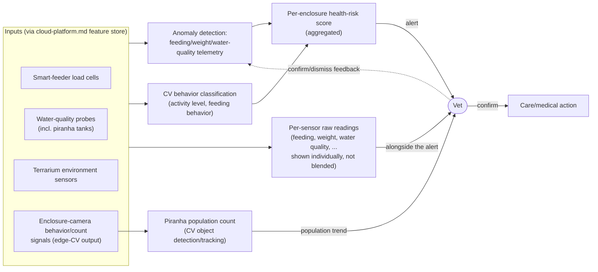

# c. Animal Health & Population Monitoring (level 2, backend)

> Zooms into capability **c** from `system-overview.md`. Backend/operations capability — output reaches a vet, never a visitor. Technique choice: [`docs/adr/0007-animal-health-anomaly-detection-technique.md`](../adr/0007-animal-health-anomaly-detection-technique.md).

## The picture

## Why this shape

- **Two model types, one score.** Telemetry anomaly detection (feeding, weight, water quality) and CV-based behavior classification are different techniques feeding the same per-enclosure risk score — because a sick animal shows up in both eating-less-than-usual data *and* different on-camera behavior, and neither signal alone is reliable enough on its own across 55 enclosures.
- **The vet sees raw readings alongside the score, not instead of it.** An aggregated risk score is good for triage ("which of 55 enclosures needs attention first"), but it can hide *which specific reading* is off, or mask a case where two signals disagree (e.g., weight is fine but water quality is trending badly). The vet gets both: the aggregated score to prioritize, and the individual feeding/weight/water-quality/behavior readings to actually diagnose — the model doesn't get to decide that's unnecessary detail.
- **Population counting is a separate output, not folded into the risk score.** Counting piranhas is a distinct problem (object detection/tracking on a tank camera feed) from "is this animal healthy" — it answers a different brief requirement (population levels) and doesn't need to share a model with health anomaly detection.
- **The vet is the only actor who can trigger action.** No automated feeding, dosing, or enclosure change happens off this pipeline — it only ever produces an alert. This is the highest-welfare-stakes backend capability, so the human-in-the-loop checkpoint is a hard gate, not a dashboard someone might ignore.
- **The vet's own confirm/dismiss decisions are the validation loop.** Every time a vet confirms a real issue or dismisses a false alarm, that recalibrates the anomaly thresholds — this is the concrete, ongoing answer to "validation and verification of AI results" for a non-deterministic signal, rather than a one-time accuracy test.

## What's still open (for a later pass, not now)

- Alert severity tiers (e.g., "check when convenient" vs. "urgent") and how those map to notification channels.
- Whether population counting runs continuously or on a scheduled cadence (tanks don't need per-second counts).

## Resolved
- ~~Is a single per-enclosure risk score enough?~~ No — the vet now gets per-sensor raw readings alongside the aggregated score (see diagram above).
