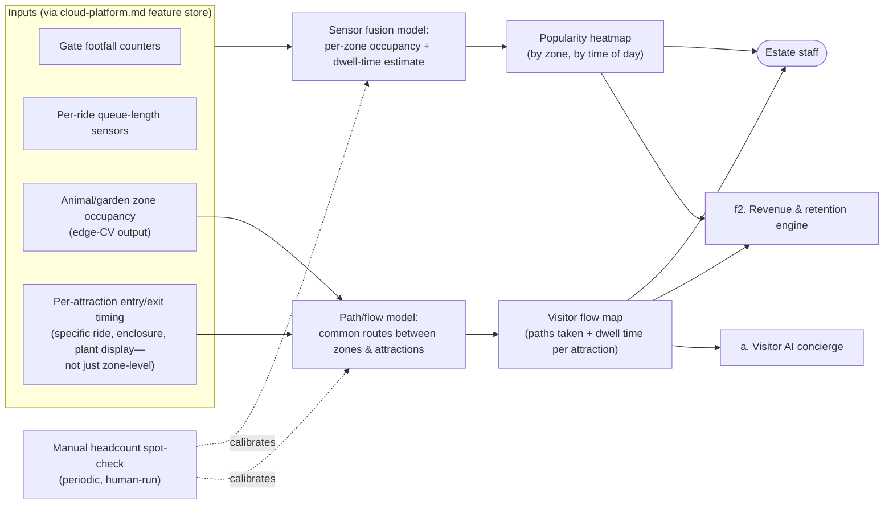

# b. Crowd & Popularity Analytics (DRAFT — level 2, backend)

> **Status: draft, level 2.** Zooming into capability **b** from `system-overview.md`. Backend/operations capability — no customer-facing surface of its own (its output feeds staff decisions and, indirectly, pricing).

## The picture

## Why this shape

- **Sensor fusion, not one sensor type alone.** Footfall counters, queue sensors, and enclosure occupancy signals each give a partial view; combining them is what actually answers "which parts of the estate are busy right now," per the brief's own framing of this as the biggest blind spot today.
- **A zone-level heatmap alone misses two things worth knowing separately: paths and per-attraction dwell time.** "This zone is busy" doesn't tell you *how visitors got there* or *which specific ride/enclosure/display inside a zone is actually holding attention* — a zone can look busy in aggregate while one enclosure is empty and the one next to it is packed. The path/flow model answers "how do crowds move between attractions" (useful for signage/layout decisions and for the concierge's route recommendations), and per-attraction entry/exit timing answers "how long do people spend at *this specific* ride/enclosure/plant display," not just "in this zone."
- **Decision support, not decision-making.** The heatmap goes to staff, who decide where to actually deploy people — this capability doesn't auto-reassign anyone. Lower-stakes than animal/plant health or maintenance, so the human-in-the-loop is lighter-touch (a dashboard, not a per-event approval), but it's still there.
- **Validation via spot-check, not blind trust.** Because "how busy is this zone" has no independent ground truth stream, the calibration loop is a human doing occasional manual headcounts and feeding that back to correct the model — the concrete answer to "how do we know it's working" for this capability specifically.
- **Feeds the revenue engine, doesn't duplicate it.** Popularity data is a direct input to `f2`'s pricing/demand model rather than crowd analytics doing its own pricing logic — one source of truth for "what's popular," used by two consumers.

## What's still open (for a later pass, not now)

- How often the heatmap refreshes (near-real-time vs. hourly rollup) — a level-3 question once we're implementing.
- Whether staff get a push alert for sudden spikes, or only pull the dashboard on demand.

## Questions for you

- Does staff need anything beyond a heatmap here (e.g., a direct staffing-recommendation number), or is "here's where it's busy, you decide" the right level of automation?
