# f1. Personalized Offers & Campaigns (DRAFT — level 2, customer-facing)

> **Status: draft, level 2.** Zooming into the customer-facing half of capability **f** from `system-overview.md`. Picks up exactly where `ai-revenue-retention.md` (f2) leaves off — it hands this module "segments," and this is what happens to them.

## The picture

```mermaid
flowchart LR
    Segments["At-risk / target visitor segments\n(from f2. Revenue & retention engine)"]

    Generate["Offer template/variant generation\n(via model gateway):\nloyalty rewards, seasonal campaigns,\nwin-back messages"]

    Marketing(["Marketing / business staff"])
    Guardrail{{"Guardrail check:\nfrequency capping,\ntone/brand-guideline compliance"}}

    Instantiate["Per-visitor instantiation\n(fills approved template with\nsegment/visitor variables)"]
    Channel["Delivery: app notification / email"]
    Visitor(["Visitor"])

    Outcome["Redeemed? Return visit?\n(actual outcome)"]
    ABTest["A/B test results"]

    Segments --> Generate --> Marketing
    Marketing -->|"approve template/campaign"| Instantiate
    Marketing -.->|"reject: revise"| Generate
    Instantiate --> Guardrail
    Guardrail -->|"pass"| Channel --> Visitor
    Guardrail -.->|"fail: revise or drop"| Generate
    Visitor --> Outcome --> ABTest
    ABTest -.->|"calibrates"| Generate
    ABTest -.->|"feeds back into"| Segments
```

## Why this shape

- **Humans review, at the template/campaign level — not one approval per individual message.** At 15,000 visitors/day, having a person sign off on every single instantiated message isn't workable, but reviewing every *template or campaign* before it's allowed to run is: marketing/business staff approve the generated offer content (the loyalty reward, the seasonal campaign copy, the win-back message) once, and only approved templates get instantiated per visitor by filling in segment/visitor variables — no fresh, unreviewed generation reaches anyone. This is the human-in-the-loop gate the backend capabilities have (vet, horticulturist, staff); it's scoped at the template level rather than the message level because that's what's actually operable at this volume.
- **The automated guardrail still runs after human approval, not instead of it.** Even an approved template's *instantiated* output (with real variables filled in) gets an automated frequency/tone check before delivery — catching per-visitor issues (e.g., cadence caps) a template-level review can't, since that depends on each visitor's own message history.
- **Doesn't re-decide who to target.** Segmentation is `f2`'s job (churn prediction); this module only decides *what to say and whether it's fit to send* to a segment it's handed — keeping one source of truth for "who's at risk" rather than two churn models disagreeing with each other.
- **The outcome loop closes back into both this module and f2.** Whether an offer actually gets redeemed or brings a visitor back is the real measure of whether personalization is working — that's the same A/B-testing validation loop `ai-revenue-retention.md` already defined, not a separate one; this is where those results actually originate.

## What's still open (for a later pass, not now)

- How often approved templates need re-review (e.g., a seasonal campaign might need refreshing rather than running unreviewed indefinitely).
- Cross-channel frequency capping (if a visitor is both emailed and app-notified, do those share one cap or two).

## Resolved
- ~~Comfortable with guardrail-only (no human review)?~~ No — marketing/business staff now review and approve every offer template/campaign before it's instantiated per visitor (see diagram above).
