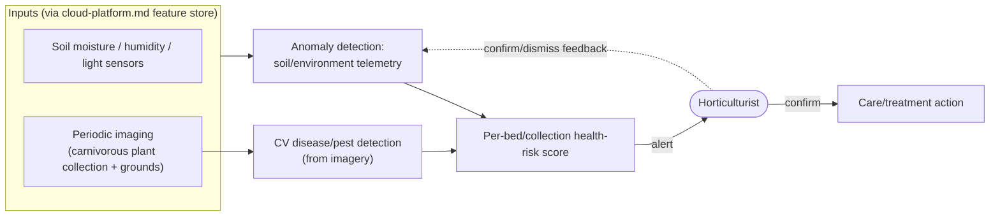

# d. Plant & Garden Health Monitoring (level 2, backend)

> Zooms into capability **d** from `system-overview.md`. Deliberately mirrors `ai-animal-health.md`'s shape — same risk profile (living-thing welfare, not visitor safety), same pattern. Technique choice: [`docs/adr/0008-plant-health-detection-technique.md`](../adr/0008-plant-health-detection-technique.md).

## The picture

## Why this shape

- **Same pattern as animal health, on purpose.** Environmental-telemetry anomaly detection + CV-based visual inspection → a risk score → a human specialist alert → human-confirmed action → confirm/dismiss feedback recalibrates the model. Reusing the shape isn't laziness — it's the "architectural characteristics match" judging criterion in action: two capabilities with the same risk profile (a living thing's welfare, not a visitor's safety) get the same architecture.
- **Why it needed calling out separately from animal health rather than merged into one "living things" capability**: different sensors (soil/light vs. feeder/water), different specialist (horticulturist vs. vet), and the carnivorous plant collection is explicitly named in the brief as an asset the family stands to lose — worth its own visible line item, not folded silently into the animal-monitoring box.
- **No autonomous treatment**, same as animal health — the model only ever produces an alert; a horticulturist decides and acts.
- **Validation is the same confirm/dismiss loop** as animal health — deliberately consistent, not reinvented per capability.

## What's still open (for a later pass, not now)

- Imaging cadence (daily walk-through captures vs. fixed cameras) — the estate's gardens are large and sprawling, so this may differ from the animal-enclosure camera setup.
- Whether pest/disease detection needs species-specific models given the carnivorous plant collection's likely rarity/diversity.

## Questions for you

- Happy with this deliberately mirroring animal health, or is there something specific to plant care that needs its own shape (e.g., seasonal patterns that animals don't have)?
