# e. Predictive Maintenance for Rides (DRAFT — level 2, backend)

> **Status: draft, level 2.** Zooming into capability **e** from `system-overview.md`. Backend/operations capability, but the highest-stakes of the five — this is a visitor-safety system wearing a maintenance-scheduling hat.

## The picture

```mermaid
flowchart LR
    subgraph Inputs["Inputs (via cloud-platform.md feature store)"]
        Mech["Structural/mechanical telemetry\n(vibration, temp, pressure, acoustic, lubrication)"]
        Safety["Safety-critical signals\n(restraint locks, e-stop log)"]
        Usage["Usage/load telemetry\n(cycles, weight, speed)"]
        Env["Environmental telemetry\n(corrosion/moisture)"]
    end

    Model["Anomaly / remaining-useful-life model,\nper ride"]
    RiskScore["Maintenance-risk score,\nprioritized by risk + safety criticality"]

    MaintStaff(["Maintenance staff"])
    OfflineRec["'Take ride offline' recommendation"]
    Offline(["Ride taken offline"])
    Repair["Repair / inspection"]
    Online(["Ride returned to service"])

    History["Actual maintenance/failure history"]

    Inputs --> Model --> RiskScore
    RiskScore -->|"alert"| MaintStaff
    RiskScore -->|"if above threshold"| OfflineRec
    OfflineRec -->|"staff sign-off required"| Offline
    Offline --> Repair --> MaintStaff
    MaintStaff -->|"staff sign-off required"| Online
    History -.->|"calibrates"| Model
```

## Why this shape

- **Four separate telemetry categories feed one model, not four models.** They were split out in `onsite-edge.md` because they're conceptually different signals, but predictive maintenance is the one capability that actually needs all four together — structural wear, safety-critical state, usage load, and environmental aging jointly determine a ride's real risk, not any one category alone.
- **The human-in-the-loop checkpoint appears twice, deliberately.** Every other backend capability gates the *action* (vet/horticulturist confirms before treatment). This one also gates *returning to service* — a ride doesn't go back online on the model's say-so either, only on staff sign-off after repair. Two gates, not one, because the failure mode here (a ride failing with visitors on it) is categorically worse than a missed animal-health alert.
- **The recommendation is explicit and named ("take ride offline"), not implicit in a risk number.** Given this is the capability most likely to face real consequences if ignored or over-trusted, the diagram makes the actual recommended action visible rather than leaving staff to interpret a score.
- **Validation against real failure history**, same consistency pattern as the other backend capabilities' confirm/dismiss loops — here it's "did the ride actually fail/need repair when predicted" rather than a human's real-time judgment call, since ride mechanical failure has more objective ground truth than "is this animal happy."

## What's still open (for a later pass, not now)

- Where the "above threshold" cutoff sits initially, before there's failure history to calibrate against (cold-start problem) — worth its own ADR.
- Whether some rides (older/more complex, e.g., anything with hydraulics) need a lower threshold than others by default.

## Questions for you

- Comfortable with a fully human-gated online/offline decision, or is there a subset of rides/situations where you'd want the system to auto-flag "offline" without waiting for staff (e.g., an active safety-interlock fault vs. a slow-building wear trend)?
