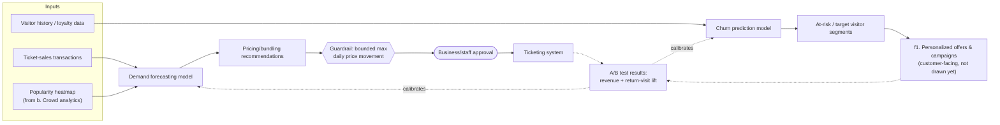

# f2. Revenue & Retention Engine (level 2, backend half of capability f)

> Zooms into the backend half of capability **f** from `system-overview.md`. This diagram stops where it hands off to **f1** (personalized offers & campaigns). Technique choice: [`docs/adr/0011-revenue-retention-model-technique.md`](../adr/0011-revenue-retention-model-technique.md).

## The picture

## Why this shape

- **Demand forecasting and churn prediction are two models, not one.** They answer different questions — "what should today's price be" vs. "who's about to stop visiting" — and feed two different downstream consumers (pricing vs. campaigns), so keeping them separate lets each be validated and iterated on independently.
- **Pricing is gated by a guardrail and a business approval, not autonomous.** This is the one backend capability where the human-in-the-loop checkpoint is there for *trust and reputation*, not safety or welfare — an AI silently doubling ticket prices on a busy day would be a PR problem long before it's a technical one. The bounded-movement guardrail plus a business sign-off is the explicit answer to that.
- **Stops at the hand-off to f1.** Churn output becomes "segments," and what actually happens with those segments (which offer, what channel, what messaging) is customer-facing territory — deliberately left to the deferred `f1` pass rather than guessed at here.
- **Validation is A/B testing against real outcomes**, not a one-time backtest — revenue and return-visit lift are the actual business metrics this capability is meant to move, so that's what closes the loop back into both models, consistent with the confirm/dismiss and failure-history loops used elsewhere.

## What's still open (for a later pass, not now)

- How segments are actually shaped/sized before handing to f1 (this is where f1's design will need to reach back into this diagram).
- Whether pricing guardrails differ by ticket type (e.g., family passes might warrant tighter bounds than individual tickets, given the brief's emphasis on family access).

## Questions for you

- Is a single bounded guardrail + business approval the right level of caution for pricing, or should certain scenarios (e.g., a sold-out day) allow more automated flexibility?
