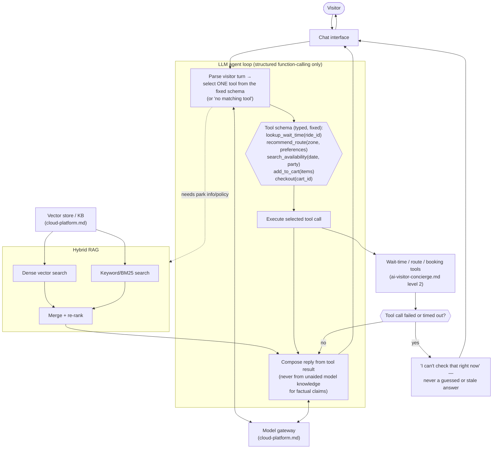

# a. Visitor AI Concierge — Level 3 (agent internals)

> Zooms into the `Agent` node from `ai-visitor-concierge.md` — the agent loop, tool schema, retrieval step, and failure handling, per the choices made in `docs/adr/0012-visitor-concierge-agent-stack.md`. Everything outside the agent (chat UI, payment charge) is unchanged from level 2.

## The picture

## Why this shape

- **The agent can only ever pick from a fixed, typed tool list, never act freeform.** `Intent` is constrained to select one of the five defined tools (or explicitly conclude none match) — per ADR-0012, this bounds the agent's action space specifically because one path leads toward a real charge. There is no "the agent decided to do something else" branch.
- **Retrieval is hybrid, not vector-only**, so an exact ride name or policy term isn't lost to a purely semantic search missing it — directly serving the grounding goal `ai-visitor-concierge.md` already established.
- **Every factual claim in a reply traces back to either a tool result or a retrieved KB passage, never the model's own unaided assertion** — `Compose` is drawn as consuming `Execute`'s or `Merge`'s output, not the raw model. This is the concrete mechanism behind "grounded, not free-floating" from the level-2 diagram.
- **Tool failure produces an honest degradation, not a guess** — the one open question flagged in `ai-visitor-concierge.md`'s "what's still open" section now has a real answer: `Degrade` routes a failed/timed-out tool call to an explicit "can't check right now" message, never a stale or fabricated one.
- **Both the intent-selection step and the reply-composition step go through the same model gateway** as every other capability (`cloud-platform.md`) — the agent loop isn't a special case for provider fallback or the training-data flywheel from ADR-0001.

## What's still open (for a later pass, not now)

- Exact re-ranking method for merging dense + keyword results (reciprocal rank fusion vs. a learned re-ranker) — an implementation-level choice, not an architectural one.
- Multi-turn state: how much conversation history the agent carries forward vs. re-retrieves each turn.
- Whether a failed tool call gets one silent retry before surfacing as "can't check right now," or surfaces immediately — a latency/UX trade-off, not drawn here.
