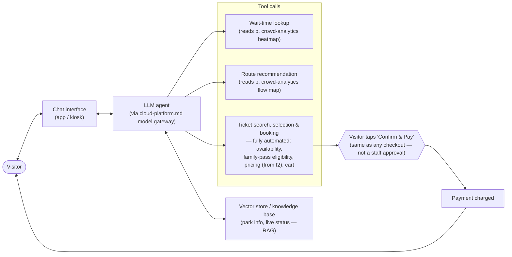

# a. Visitor AI Concierge (DRAFT — level 2, customer-facing)

> **Status: draft, level 2.** Zooming into capability **a** from `system-overview.md`. Customer-facing — the one capability that's actually a conversation, and the one deliberately built agentic (LLM + tool calls), mirroring the brief's own example diagram.

## The picture

## Why this shape

- **Fully automated booking, one manual tap.** Every step up to "here's your cart, ready to book" is automated — availability, family-pass eligibility, pricing, and assembly all happen without any staff in the loop. The one thing the visitor does themselves is the **same final tap any booking website already requires** ("Confirm & Pay") — this isn't an approval bottleneck, it's the standard checkout click, made explicit here only because it was ambiguous when left implicit. Nothing charges a card without that tap.
- **Grounded, not free-floating.** The agent answers from the vector-store/knowledge base (park info, live status) via RAG, rather than generating facts from the model alone — the risk profile here is "confidently wrong," not welfare/safety, so the validation concern is grounding and hallucination-avoidance rather than a confirm/dismiss loop.
- **Reuses crowd-analytics outputs rather than re-deriving them.** Wait times and route recommendations are tool calls into `b`'s heatmap and flow map (the flow map addition from the crowd-analytics refinement is exactly what makes route recommendation possible) — one source of truth for "what's busy and how to get around it," consumed here, not recomputed.
- **Everything goes through the model gateway**, same as every other capability — so a provider swap or outage affects this agent the same structural way it affects the backend capabilities, not as a special case.

## What's still open (for a later pass, not now)

- What happens when the agent is uncertain or the tool calls fail (e.g., booking system momentarily unavailable) — a graceful-degradation path, not designed yet.
- Whether the concierge also handles post-visit interactions (reviews, complaints) or stays scoped to pre-visit/in-visit only.

## Questions for you

- Anything beyond wait-time, routes, and booking you want the concierge to handle at this level (e.g., accessibility needs, dietary/allergy info for food stalls)?
