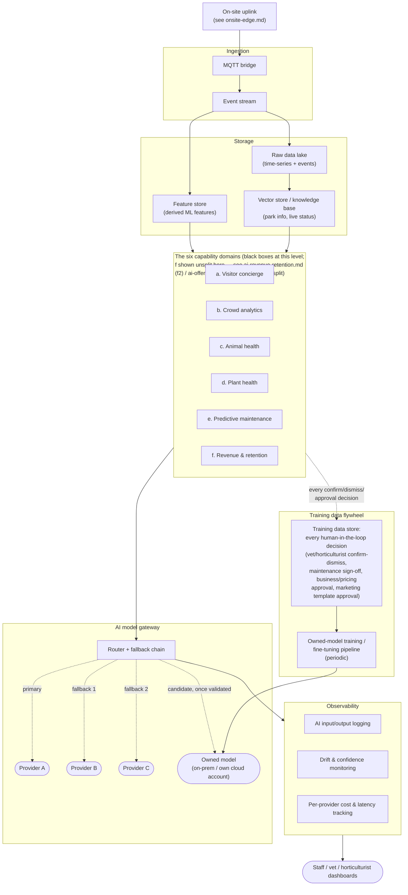

# Cloud Platform & Model Gateway (level 2)

> Zooms into the "Cloud data & AI platform" box from [`system-overview.md`](system-overview.md) — one level deeper, no further. Individual AI capabilities (a–f) are black boxes here; see their own diagrams for internals.

## The picture

**Key:** solid arrows are reads/writes of data (e.g., `Features --> Capabilities` means capabilities *read* from the feature store, not write to it — the only things capabilities write are the training-data flywheel's confirm/dismiss/approval events, shown separately below). Dashed arrows inside the gateway are the fallback order — if Provider A fails, is too slow, or gets too expensive, the router falls back to B, then C, without any capability needing to know or care which provider actually answered. The dashed arrow into the training-data store is the same human-in-the-loop decisions already shown in each capability's own diagram (vet confirm/dismiss, staff sign-off, business approval, marketing template approval) — collected centrally here rather than staying siloed per capability.

## The decision this diagram is making

1. **Every capability goes through one gateway — none call a model provider directly.** This is the structural answer to "what happens if a provider changes price or shuts down": swapping or re-ordering providers is a one-place change in the router, not a rewrite across six capabilities. Ties directly back to the consistency principle from the high-level view.
2. **Storage is split three ways on purpose.** The raw data lake is the system of record (everything landing off the event stream); the feature store holds the *derived* signals models actually train/infer on (so capabilities aren't each re-deriving features from raw telemetry); the vector store is specifically the visitor concierge's RAG knowledge base (park info, live status) — a different access pattern from the other two, so it's kept as its own store rather than bolted onto the feature store.
3. **Observability wraps the gateway, not each capability individually.** Logging every AI input/output, watching for drift or low-confidence outputs, and tracking cost/latency per provider all happen once, centrally — this is what "validation and verification of AI results" looks like structurally, rather than as a promise made six separate times.
4. **The six capabilities are still black boxes here.** This diagram deliberately stops at "they consume features/vectors and go through the gateway" — what each one actually does internally (which model type, what triggers a human-in-the-loop check, etc.) is a capability-by-capability pass, later.
5. **Every human-in-the-loop decision doubles as training data, not just a one-off calibration signal.** Each capability already has its own confirm/dismiss or approval loop (see `ai-animal-health.md`, `ai-predictive-maintenance.md`, `ai-revenue-retention.md`, `ai-offers-campaigns.md`, etc.) — this diagram adds one central place those decisions *also* land, feeding a periodic training/fine-tuning pipeline for an **owned model** (on-prem or the estate's own cloud account). That owned model becomes a fourth candidate in the router's chain once it clears the same validation bar as any provider — this is what turns "swap providers cheaply" into "become less dependent on any third-party provider over time," reusing decisions the design already produces rather than requiring new instrumentation.

## What's still open (for a later pass, not now)

- Which specific model/provider types sit behind "Provider A/B/C" for which capability (e.g., the visitor concierge likely wants an LLM; animal-health anomaly detection likely doesn't) — that's part of each capability's own level-2/3 design.
- The exact trigger for the router falling back (latency threshold? error rate? price cap?) — worth its own ADR once this shape is agreed.
- How staff dashboards differ from the vet/horticulturist views shown in `system-overview.md` — collapsed into one box here for simplicity.
- How much training data is needed before the owned model is even a candidate worth evaluating, and what "cleared the validation bar" means concretely (a level-3 / ADR-0001 question).
- Data governance for the training-data store (retention, access control, anonymization of any visitor-linked history) — not designed yet.

## Questions for you

- Three-way storage split (data lake / feature store / vector store) — right shape, or overkill for now?
- Generic "Provider A/B/C" — fine to stay vendor-agnostic at this level, or do you want to name real candidates already?
- What's next — an ADR to lock in the model-gateway/fallback decision, or drilling into one specific AI capability (concierge, animal/plant health, crowd analytics, maintenance, or revenue)?
