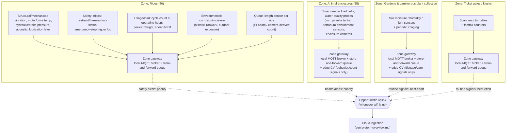

# On-Site / Edge Layer (level 2)

> Zooms into the "Estate (on-site)" box from [`system-overview.md`](system-overview.md) — one level deeper, no further. The cloud platform and the AI capabilities themselves are covered in their own diagrams.

## The picture

**Key:** solid arrows are always-on, wired/local connections within a zone. Dashed arrows are the patchy wifi link — intermittent by design, which is why every zone gateway can queue locally and doesn't block on it.

## The decision this diagram is making

1. **One gateway per zone, not one gateway for the whole estate.** The park is large and sprawling with patchy wifi — a single estate-wide gateway would mean a dead zone in one corner (say, the far end of the animal enclosures) takes down monitoring everywhere. Per-zone gateways mean each area keeps working locally regardless of what the wifi is doing elsewhere.
2. **Store-and-forward at every gateway.** Each zone gateway holds a local MQTT broker with a persistent queue — sensors always have somewhere to publish to, even with zero uplink, and nothing is lost, only delayed.
3. **Camera data never leaves the zone as raw video.** Both animal-enclosure and garden zones run lightweight edge inference locally (behavior flags, population counts, disease signals) and only forward the derived signal, not the footage. This is what actually makes the wifi constraint survivable for the two capabilities that would otherwise be bandwidth-heavy.
4. **Not all data is equal once it does get a chance to sync.** Safety-relevant signals (ride anomalies, acute animal-health alerts) are marked priority so they jump the queue over routine analytics data (footfall counts, routine garden readings) when the uplink window is short.
5. **Ride telemetry is broken into four categories, not one blob.** Structural/mechanical (vibration, temp, pressure, acoustic, lubrication) and usage/load (cycles, weight, speed) are what predictive maintenance (capability e) actually trains on; safety-critical signals (restraint locks, e-stop log) are what get the priority-uplink tag; environmental (corrosion/moisture) matters because these are 18th-century rides aging outdoors; and queue-length is really a crowd-analytics (capability b) input that happens to live in this zone. Splitting them out now means each downstream capability can be pointed at exactly the signals it needs later, instead of one undifferentiated "ride telemetry" stream.

## What's still open (for a later pass, not now)

- Exact backhaul technology between zone gateways and the internet (site-wide wifi mesh vs. a wired trunk vs. cellular failover) — noted as a decision to make, not made here.
- Power/connectivity for gateways in genuinely remote corners of the estate (solar/battery) — out of scope for this level.
- The cloud-side ingestion design this uplinks into — that's `system-overview.md`'s "Cloud ingestion" box, not detailed yet.

## Questions for you

- Four zones (rides, animals, gardens, gates) — right split, or does any zone need to be broken down further (e.g. aquatic vs. land enclosures)?
- Happy with "one gateway per zone" as the shape, or did you have something more/less centralized in mind?
- What's next — the cloud platform side, a specific AI capability, or an ADR to lock in the edge-buffering decision above?
