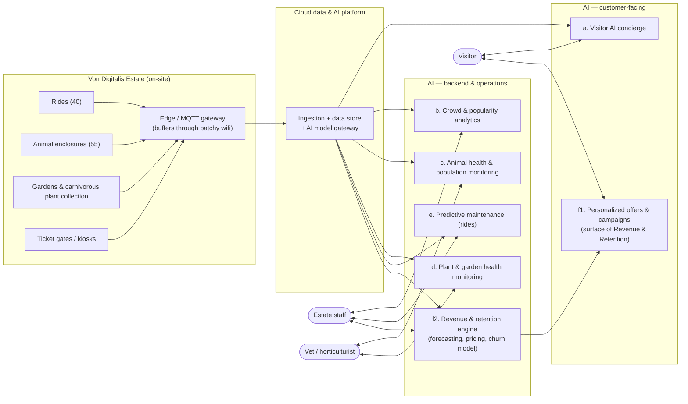

# System Overview (DRAFT — high-level, for review)

> **Status: draft, level 1 of N.** This is deliberately shallow — just the actors and major building blocks, so we can agree on the shape before drilling into any one piece. Nothing here is final.

## The picture

No key needed yet — everything here is just a box; we'll add shape/color meaning once diagrams get more specific.

## The six AI capabilities, grouped by who they serve

**Customer-facing:**
- **a. Visitor AI concierge** — a chat assistant visitors talk to (app/kiosk) that can check wait times, suggest a route around crowding, and adjust or buy tickets. The one place we're deliberately going agentic (LLM + tool calls), because it's the one capability that's actually a conversation.
- **f1. Personalized offers & campaigns** — the visitor-facing surface of Revenue & Retention: loyalty/referral programs, seasonal campaigns, personalized win-back offers to turn one-time visitors into repeat ones.

**Backend & operations:**
- **b. Crowd & popularity analytics** — turns footfall/camera data into "which parts of the estate are busy right now," feeding staffing decisions and (later) pricing. Answers "we have no idea what's popular."
- **c. Animal health & population monitoring** — watches feeding, weight, water quality, and behavior across the 55 enclosures, plus counts the piranha population; flags a vet rather than acting on its own.
- **d. Plant & garden health monitoring** — same shape as (c) but for the carnivorous plant collection and grounds: soil/humidity/light sensors + imaging, flags a horticulturist. Added because the plant collection is explicitly named in the brief as an asset the family could lose — it deserves the same care as the animals, not an afterthought.
- **e. Predictive maintenance for rides** — watches ride telemetry (vibration, cycles) to flag problems on 18th-century rides before they fail. Safety + cost.
- **f2. Revenue & retention engine** — forecasts demand to drive dynamic pricing/bundling, and predicts who's likely to churn; its output *drives* f1's campaigns and offers but the modeling itself is a backend, staff-facing capability.

`f` is genuinely two capabilities wearing one name — the engine (backend) and the offers it produces (customer-facing) — so it's split into `f1`/`f2` rather than forced into one box.

Underneath all six: an **edge/MQTT layer** that copes with patchy on-site wifi (buffers locally, syncs when it can), and a **cloud platform** with a **model gateway** sitting in front of whatever AI providers/models we actually pick — so we're not locked into one vendor. Both are just named here; not designed yet.

**Consistency check across all six** (a running concern, not a one-time pass): each backend capability follows the same shape — sensor/data in, anomaly/model output, a human (vet, horticulturist, staff) in the loop before anything acts on it — and every capability, customer-facing or not, ultimately depends on the same model gateway, so swapping or losing an AI provider is a platform-level fix, not a six-times-over rewrite.

## Next: drilling into the on-site part

See [`onsite-edge.md`](onsite-edge.md) for the zoomed-in view of the estate side of this diagram (zones, sensors, and how each zone copes with patchy wifi on its own).
