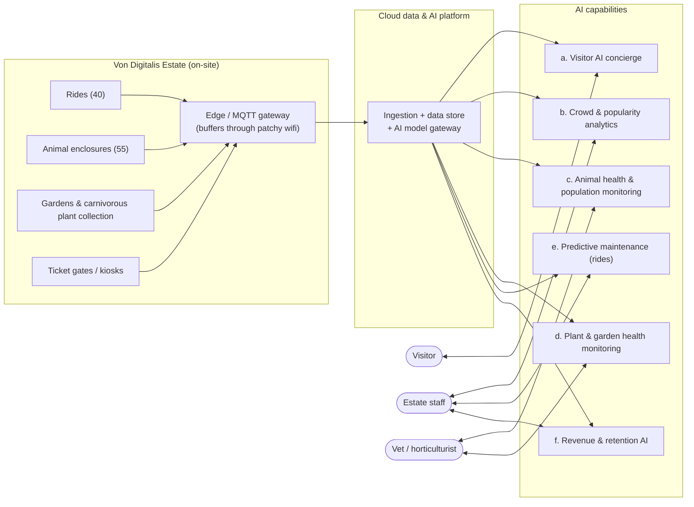

# System Overview (DRAFT — high-level, for review)

> **Status: draft, level 1 of N.** This is deliberately shallow — just the actors and major building blocks, so we can agree on the shape before drilling into any one piece. Nothing here is final.

## The picture

No key needed yet — everything here is just a box; we'll add shape/color meaning once diagrams get more specific.

## The six AI capabilities, in one paragraph each

- **a. Visitor AI concierge** — a chat assistant visitors talk to (app/kiosk) that can check wait times, suggest a route around crowding, and adjust or buy tickets. Customer-facing; the one place we're deliberately going agentic (LLM + tool calls), because it's the one capability that's actually a conversation.
- **b. Crowd & popularity analytics** — turns footfall/camera data into "which parts of the estate are busy right now," feeding staffing decisions and (later) pricing. Business-facing, answers "we have no idea what's popular."
- **c. Animal health & population monitoring** — watches feeding, weight, water quality, and behavior across the 55 enclosures, plus counts the piranha population; flags a vet rather than acting on its own.
- **d. Plant & garden health monitoring** — same shape as (c) but for the carnivorous plant collection and grounds: soil/humidity/light sensors + imaging, flags a horticulturist. Added because the plant collection is explicitly named in the brief as an asset the family could lose — it deserves the same care as the animals, not an afterthought.
- **e. Predictive maintenance for rides** — watches ride telemetry (vibration, cycles) to flag problems on 18th-century rides before they fail. Safety + cost.
- **f. Revenue & retention AI** — forecasts demand to drive pricing/bundling, and predicts who's likely to churn to drive repeat visits. The direct answer to "grow to 15,000 visitors/day and stay profitable."

Underneath all six: an **edge/MQTT layer** that copes with patchy on-site wifi (buffers locally, syncs when it can), and a **cloud platform** with a **model gateway** sitting in front of whatever AI providers/models we actually pick — so we're not locked into one vendor. Both are just named here; not designed yet.

## Questions for you

- Right six capabilities, or should any be split, merged, or dropped?
- Any estate asset we're still missing (the brief mentions rides, animals, and — via the "carnivorous plant collection" aside — gardens; anything else)?
- Which one do you want to drill into first once you've reacted to this?
