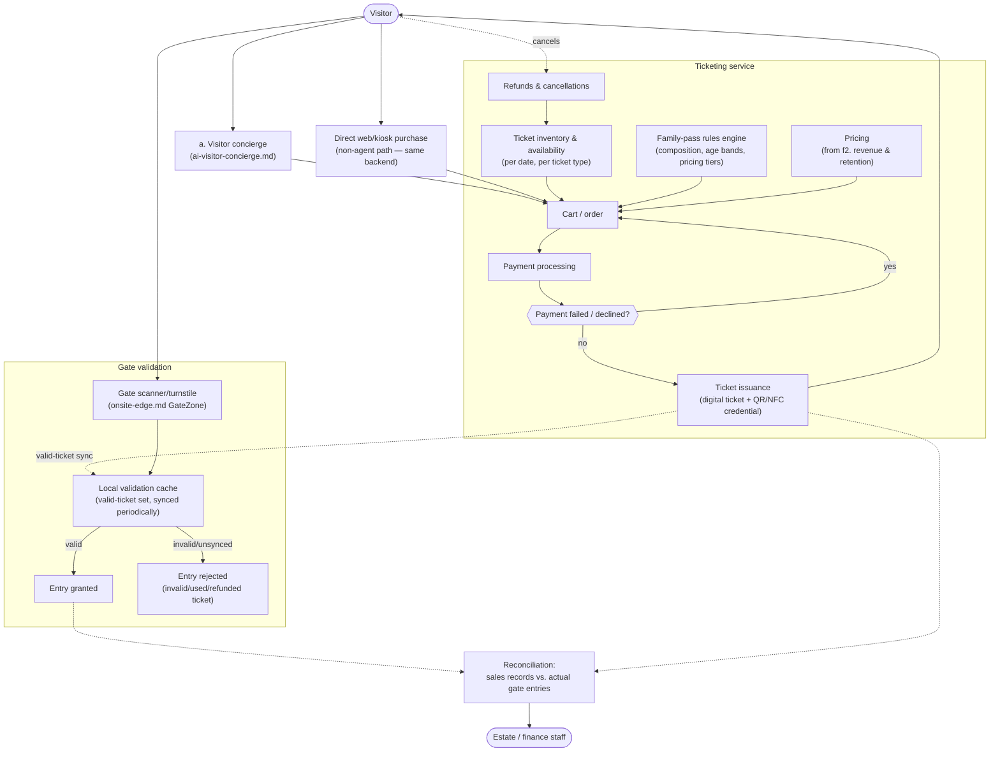

# Ticketing, Family Passes & Gate Validation (level 2)

> Standalone domain view — not AI-specific. `ai-visitor-concierge.md` shows the concierge's *booking tool calls* into this domain; this diagram shows the domain itself: inventory, family-pass rules, payment handling, issuance, and gate validation, including offline behavior. Capacity/availability assumptions: [`docs/adr/0014-capacity-and-scale-assumptions.md`](../adr/0014-capacity-and-scale-assumptions.md).

## The picture

## Why this shape

- **The concierge is one entry point into this domain, not the domain itself.** `ai-visitor-concierge.md`'s booking tool calls (`search_availability`, `add_to_cart`, `checkout`, per `docs/adr/0012`) call into the same `Inventory`/`FamilyRules`/`Pricing`/`Cart` shown here — a direct web/kiosk purchase path exists too, for a visitor who doesn't use the agent at all. Neither path bypasses the other; both terminate in the same ticket issuance and gate-validation flow.
- **Family-pass rules are a distinct rules engine, not folded into generic pricing.** The brief calls out family passes explicitly; composition rules (how many adults/children qualify, age bands) are a business-rules concern separate from `f2`'s demand-driven pricing, even though pricing itself is sourced from `f2`.
- **Payment failure loops back to the cart, not to a dead end.** A declined payment returns the visitor to `Cart` (same UX as any commercial checkout) rather than losing the in-progress order — consistent with `docs/adr/0006`'s "fully automated, like any booking website" principle.
- **Gate validation works from a local cache, not a live call to the ticketing service.** `onsite-edge.md` already establishes that on-site connectivity is patchy — gate scanners validate against a periodically-synced local set of valid tickets (`LocalValidate`), so a gate keeps functioning (accepting previously-synced valid tickets) even during a connectivity gap, at the cost of a ticket issued in the last sync window potentially not yet being recognized at the gate until the next sync. This is the same store-and-forward philosophy as the rest of the edge design (`docs/adr/0003`), applied to ticket validity instead of sensor telemetry.
- **Reconciliation closes the loop between sales and actual entries** — every issued ticket and every gate entry feeds a reconciliation step staff can use to catch double-use attempts, no-shows, or sync gaps, rather than trusting sales records alone as "what actually happened at the gate."

## What's still open (for a later pass, not now)

- Exact gate-offline grace period (how stale can `LocalValidate`'s cache be before staff intervene manually) — a parameter, not a structural decision.
- Whether family-pass composition rules differ for the customer-facing surface (concierge/web) vs. an on-site staffed ticket window, if one exists.
- Group/school bookings, season passes, or other ticket types beyond individual and family passes — not scoped here, extendable within the same `Inventory`/`FamilyRules` shape.
